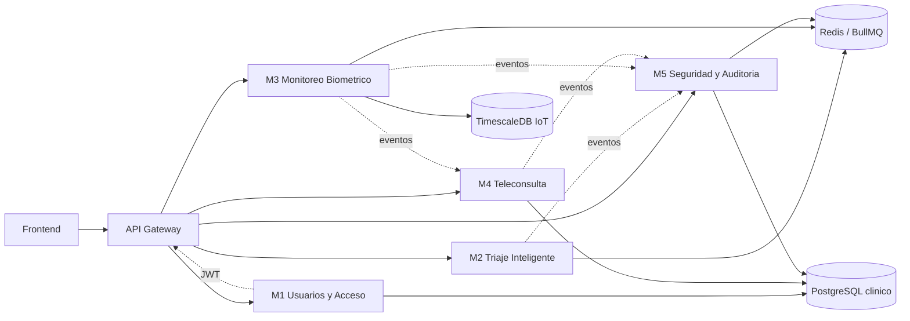

# SAMR

Sistema de Atencion Medica Remota distribuido en microservicios, con un API Gateway como punto unico de entrada, persistencia separada por dominio y una capa compartida de modelos de negocio.

## Arquitectura general

### Capas del sistema

- `frontend/`: cliente web aun no materializado en el repositorio.
- `backend/gateway/`: entrada unica del sistema, responsable de ruteo y validacion del JWT.
- `microservices/`: dominios funcionales separados por responsabilidad.
- `database/`: scripts y migraciones de base de datos.
- `deployment/`: orquestacion local con Docker Compose.
- `shared/models/`: contratos de dominio comunes entre modulos.

## Componentes y responsabilidad

### API Gateway

Punto de entrada unico. Debe validar el JWT emitido por M1 y enrutar peticiones a M1-M5 sin contener logica de negocio.

### M1 - Usuarios y Acceso

Gestiona registro, login, MFA, verificacion IESS y consentimiento LOPDP. Es el unico modulo que emite JWT.

### M2 - Triaje Inteligente

Recibe solicitudes de triaje, evalua sintomas o alertas IoT, consulta Med-Gemini y realiza matching con centros de asistencia.

### M3 - Monitoreo Biometrico

Ingiere datos IoT, detecta anomalias y distribuye alertas a paciente, medico y centro de asistencia.

### M4 - Teleconsulta

Gestiona video/audio por WebRTC, apoyo diagnostico XAI y emision de receta digital.

### M5 - Seguridad y Auditoria

Consume eventos del resto del sistema, los normaliza, los hashiza con SHA-256 y conserva trazabilidad inmutable.

## Infraestructura local

El `docker-compose.yml` define estos servicios:

- `gateway` en `3000`
- `m1` en `3001`
- `m2` en `3002`
- `m3` en `3003`
- `m4` en `3004`
- `m5` en `3005`
- `postgres` para datos clinicos
- `timescaledb` para telemetria IoT
- `redis` para colas y eventos
