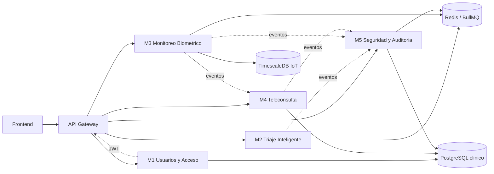

# SAMR

Sistema de Atencion Medica Remota distribuido en microservicios, con un API Gateway como punto unico de entrada, persistencia separada por dominio y una capa compartida de modelos de negocio.

## Arquitectura general

### Capas del sistema

- `frontend/`: cliente web aun no materializado en el repositorio.
- `backend/gateway/`: entrada unica del sistema, responsable de ruteo y validacion del JWT.
- `microservices/`: dominios funcionales separados por responsabilidad.
- `database/`: scripts y migraciones de base de datos.
- `deployment/`: orquestacion local con Docker Compose.
- `shared/models/`: contratos de dominio comunes entre modulos.

## Componentes y responsabilidad

### API Gateway

Punto de entrada unico. Debe validar el JWT emitido por M1 y enrutar peticiones a M1-M5 sin contener logica de negocio.

### M1 - Usuarios y Acceso

Gestiona registro, login, MFA, verificacion IESS y consentimiento LOPDP. Es el unico modulo que emite JWT.

### M2 - Triaje Inteligente

Recibe solicitudes de triaje, evalua sintomas o alertas IoT, consulta Med-Gemini y realiza matching con centros de asistencia.

### M3 - Monitoreo Biometrico

Ingiere datos IoT, detecta anomalias y distribuye alertas a paciente, medico y centro de asistencia.

### M4 - Teleconsulta

Gestiona video/audio por WebRTC, apoyo diagnostico XAI y emision de receta digital.

### M5 - Seguridad y Auditoria

Consume eventos del resto del sistema, los normaliza, los hashiza con SHA-256 y conserva trazabilidad inmutable.

## Infraestructura local

El `docker-compose.yml` define estos servicios:

- `gateway` en `3000`
- `m1` en `3001`
- `m2` en `3002`
- `m3` en `3003`
- `m4` en `3004`
- `m5` en `3005`
- `postgres` para datos clinicos
- `timescaledb` para telemetria IoT
- `redis` para colas y eventos

## Estado real del repositorio

Hoy el proyecto esta en una fase inicial de esqueleto funcional:

- El Gateway solo expone `health` y aun no enruta peticiones.
- M1 implementa `register`, `login` y `verify`, pero no integra los flujos completos de consentimiento, MFA ni verificacion IESS.
- M2, M3, M4 y M5 solo exponen `health`.
- No existen pruebas automatizadas en los directorios `tests/`.
- Los contratos OpenAPI estan definidos por modulo, pero la implementacion no cubre la mayoria de esos endpoints.
- `shared/models/` contiene los tipos de dominio, pero falta la capa compartida de contratos/eventos que el diseno menciona.

## Roles y responsables

La asignacion de trabajo queda definida con los nombres del documento de vision. El orden sugerido respeta dependencias reales del sistema: primero base de datos y arquitectura, luego seguridad y backend, despues frontend y cierre de pruebas/documentacion.

| Integrante | Rol | Primero que debe hacer | Entrega exacta que debe completar |

| --- | --- | --- | --- |
| Julio Maldonado | Administrador de Base de Datos | Definir la base persistente del sistema para que todo lo demas pueda funcionar sobre una estructura estable. | Terminar los esquemas de PostgreSQL y TimescaleDB, crear migraciones, llaves foraneas, indices y restricciones, dejar datos semilla, y validar que M1, M3, M4 y M5 puedan leer y escribir sin romper el modelo de datos. 

|
| Leydi Robalino | Arquitecto de Software | Cerrar la arquitectura objetivo y asegurar que cada modulo tenga una responsabilidad unica. | Completar la arquitectura logica y fisica, definir flujos entre Gateway, M1-M5, fijar contratos entre modulos, definir dependencias, eventos y limites de cada servicio, y dejar documentada la trazabilidad del sistema. 

|
| Alisson Condoy | Especialista en Seguridad | Asegurar autenticacion, autorizacion, auditoria y controles de entrada antes de abrir el sistema. | Terminar la estrategia de seguridad del Gateway y M1, definir validacion JWT, MFA, manejo de sesiones, politica de secretos, trazabilidad de eventos y requisitos LOPDP para que el sistema no exponga datos sensibles.

 |
| Antonela Parra | Desarrollador Backend | Implementar la logica de negocio y los endpoints de los microservicios. | Completar Gateway, M1, M2, M3, M4 y M5 en la capa backend: rutas, validaciones, integracion con base de datos, colas, eventos, adaptadores externos y cumplimiento de los contratos OpenAPI de cada modulo. 

|
| Paula López | Desarrollador Frontend | Construir la experiencia de usuario que consuma los servicios ya definidos por backend. | Completar el frontend conectado al Gateway, crear pantallas de registro, login, triaje, monitoreo, teleconsulta y auditoria, manejar estados, formularios y consumo de API, y dejar el flujo navegable de punta a punta. 

|
| David León | Diseñador UX/UI | Definir la experiencia, jerarquia visual y claridad operativa del sistema antes de cerrar la interfaz. | Entregar prototipos, flujos de navegacion, sistema visual, componentes reutilizables, estados de error/exito, version responsive y guia visual para que frontend implemente una interfaz coherente y util. |

## Que debe hacer cada integrante exactamente

### Julio Maldonado - Administrador de Base de Datos

Debe empezar por la base de datos, porque el resto del sistema depende de eso. Su orden recomendado es:

- 1. Revisar los modelos de dominio y decidir la estructura final de tablas.
- 2. Crear o terminar los esquemas de PostgreSQL y TimescaleDB.
- 3. Definir migraciones y relaciones entre usuarios, pacientes, consultas, solicitudes, alertas y auditoria.
- 4. Crear restricciones, llaves foraneas e indices.
- 5. Preparar datos semilla y validar que los servicios conecten correctamente.
- 6. Dejar la persistencia lista para que M1, M3, M4 y M5 puedan leer y escribir.

### Leydi Robalino - Arquitecto de Software

Debe cerrar la arquitectura para que no existan ambiguedades entre modulos. Su orden recomendado es:

- 1. Confirmar el mapa completo de servicios: Gateway, M1, M2, M3, M4 y M5.
- 2. Definir las responsabilidades exactas de cada modulo.
- 3. Alinear los contratos OpenAPI con el flujo de negocio real.
- 4. Definir eventos entre servicios y que modulo produce o consume cada uno.
- 5. Validar dependencias de infraestructura: PostgreSQL, TimescaleDB y Redis.
- 6. Documentar el flujo extremo a extremo desde autenticacion hasta auditoria.

### Alisson Condoy - Especialista en Seguridad

Debe asegurar que el sistema no se abra sin control de acceso ni trazabilidad. Su orden recomendado es:

- 1. Definir como se valida el JWT emitido por M1.
- 2. Revisar el flujo de autenticacion y MFA.
- 3. Establecer manejo seguro de secretos y variables de entorno.
- 4. Definir reglas de acceso por rol y por modulo.
- 5. Asegurar la trazabilidad de eventos para auditoria.
- 6. Proponer controles LOPDP y criterios de inmutabilidad en M5.

### Antonela Parra - Desarrollador Backend

Debe construir la logica funcional de los servicios. Su orden recomendado es:

- 1. Completar el API Gateway para enrutar a M1-M5.
- 2. Terminar M1 con registro, login, MFA, IESS y consentimiento.
- 3. Implementar M2 con triaje, matching y cola de procesamiento.
- 4. Implementar M3 con ingesta IoT, alertas y persistencia en TimescaleDB.
- 5. Implementar M4 con teleconsulta, decisiones medicas y receta digital.
- 6. Implementar M5 con consumo de eventos, hash SHA-256 y exportacion de auditoria.
- 7. Conectar todo con las pruebas de contrato y validacion de flujos.

### Paula López - Desarrollador Frontend

Debe convertir la arquitectura en una interfaz usable para los roles operativos. Su orden recomendado es:

- 1. Construir login, registro y recuperacion de acceso.
- 2. Implementar navegacion por rol y permisos visibles.
- 3. Crear pantallas para triaje, monitoreo, teleconsulta y auditoria.
- 4. Conectar formularios y vistas con los endpoints reales del backend.
- 5. Manejar estados de carga, error, vacio y exito.
- 6. Validar que la experiencia sea responsive y consistente con el diseno.

### David León - Diseñador UX/UI

Debe dejar lista la experiencia antes de que el frontend se cierre. Su orden recomendado es:

- 1. Definir flujos de usuario para paciente, medico, administrativo, MSP y DPO.
- 2. Diseñar wireframes y prototipos de las pantallas clave.
- 3. Definir jerarquia visual, colores, tipografia y componentes.
- 4. Establecer estados de formularios, alertas, tablas y paneles.
- 5. Entregar guia visual para implementacion en frontend.
- 6. Validar accesibilidad y comportamiento responsive.

## Que falta por modulo

### Gateway

- Enrutamiento real a los cinco microservicios.
- Validacion JWT completa.
- Middleware de logging y errores.
- Configuracion de seguridad en entrada, incluyendo TLS.

### M1

- Endpoints de MFA, IESS y consentimiento.
- Validaciones de negocio del registro.
- Integracion formal con eventos de auditoria.
- Pruebas automatizadas.

### M2

- API real de triaje, matching y consulta de estado.
- Cola de procesamiento con Redis/BullMQ.
- Adaptador a Med-Gemini con campo `explanation` obligatorio.
- Circuit breaker y modo degradado.
- Pruebas automatizadas.

### M3

- Ingesta IoT real.
- Persistencia en TimescaleDB.
- Deteccion de anomalias y distribucion simultanea de alertas.
- Integracion con Med-Gemini.
- Pruebas automatizadas.

### M4

- Flujo WebRTC completo.
- Registro de decisiones medicas y receta digital.
- Persistencia del historial clinico.
- Integracion XAI sin afectar el stream de video.
- Pruebas automatizadas.

### M5

- Consumo real de eventos de M1, M2, M3 y M4.
- Hash SHA-256 e inmutabilidad de logs.
- Endpoints de auditoria y exportacion.
- Persistencia y cola de procesamiento.
- Pruebas automatizadas.

## Siguiente paso recomendado

Completar primero los contratos de cada microservicio junto con sus pruebas, y despues implementar el flujo de extremo a extremo: autenticar en M1, enrutar desde Gateway, generar triaje en M2, registrar alerta en M3, atender en M4 y consolidar trazabilidad en M5.